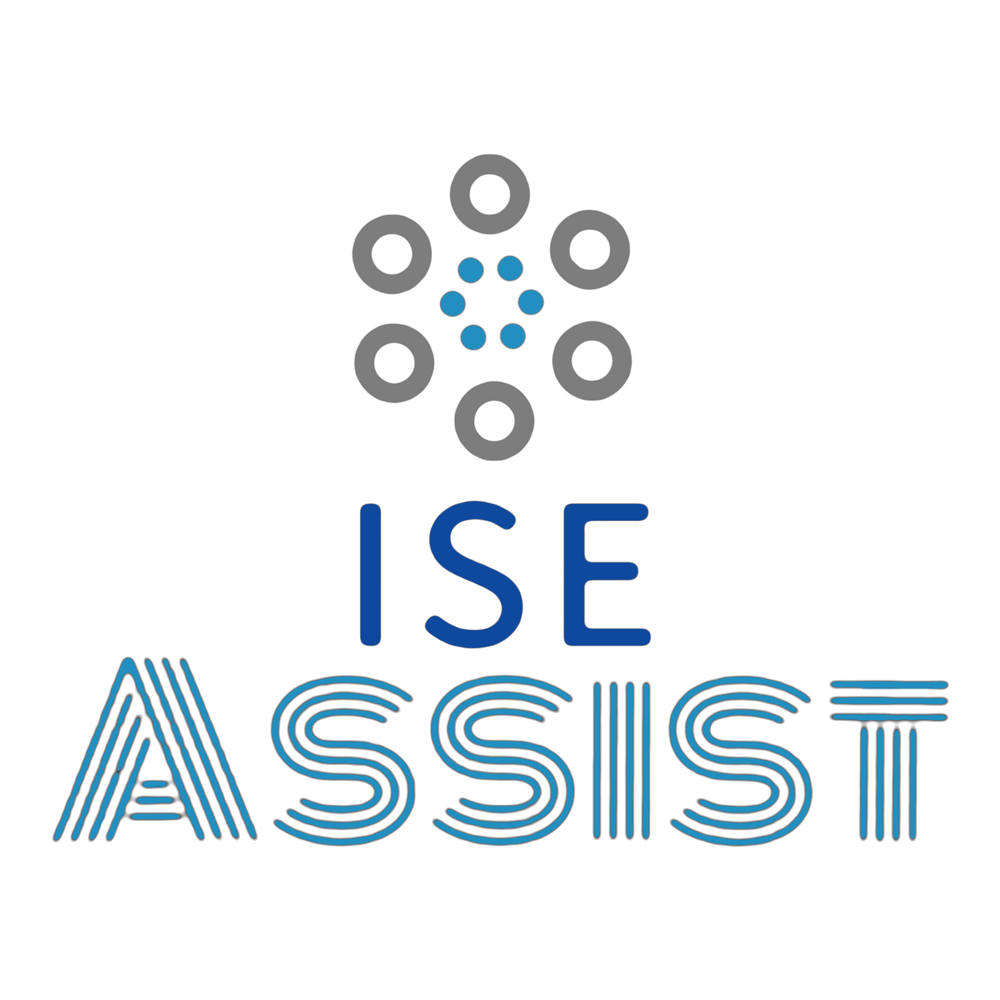

# Assisting Students in Efficient and Effective Learning 

## Link to your source code on a public repository on GitHub with README.md file containing

**the project title, a short description, project architecture, libraries used, screenshots of the visualizations, detailed documentation on how to run and deploy your project, and group members**

