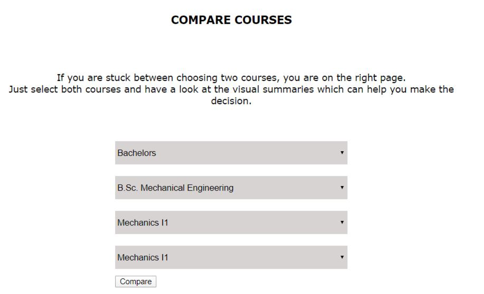

# Assisting Students in Efficient and Effective Learning 

## Project Description

Alike cultural integration, newly coming international students face various problems in adopting the learning methods which are effective and usefull to successfully complete the study programs. Amongst the most common problems are **course selection, pre-knowledge of the courses, study programs and effective learning methods, and the recorded grades** of prior students. Moreover, the suggestions and recommendations are also necessary for the backgroud knowledge of different courses and study programs in International Students Exchange(ISE) program. Addressing the mentioned problems, this project helps and enables students to have an overview of all the programs and courses coming under the umbrella of ISE program. Students can search, compare and perform diverse range of queries responded by visual based dynamic responses, making the results understandable for them. The said platform is web-based application, named ISE Assist, is developed using JavaScript at the back-end, HTML, CSS and Bootstrap at the front-end, served by Node and Express server.

## Project Architecture

We set the **Node.js server and Express.js server*** and developed the modules which will be used for querying from the client side and responded from the server side. We used Express.js server to manage our routes in the better way possible, making the project open and easy for future development and plugging in with additional modules in future.
For front-end development, we used **HTML at the structural level, CSS and Bootstrap** for designing and basic JavaScript to handle client-side events. The backend is entirely based on JavaScript and jQuery, both for processing, querying and responding. For visualizations, we have chosen Highcharts.js because it was easy to manage, fancy and the visualizations seems better than those made using D3.js or C3.js. Highcharts.js also provides plenty of default utilities which are easy and comfortable to use such as colours of bars, ledgers and text etc. 

## Screenshots of the Visualizations

## How to Run and Deploy

Because of our project have static website files, we used NodeJs. That is why, we need to run node(NodeJS) with http server. 

**Steps**

* Download and extract this repository.

* Download and Install NodeJS under the "express" folder, download the latest stable release of NodeJS from https://nodejs.org and install using all the default options.

* Install the http-server package from npm, Install the http-server globally on your machine using the node package manager (npm) command line tool **npm install -g http-server**

* Change to the directory containing your static web files (file name :express) in the command line/terminal window

* Start the server with **http-server**

## Group Members

* Tianyu Zhu
* Muhammad Dawar
* Hasan Halacli

**the project title, a short description, project architecture, libraries used, screenshots of the visualizations, detailed documentation on how to run and deploy your project, and group members**

